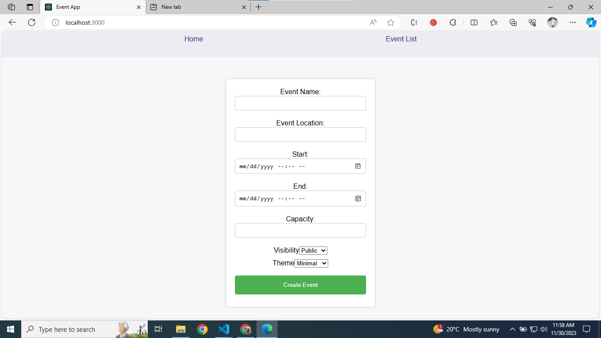
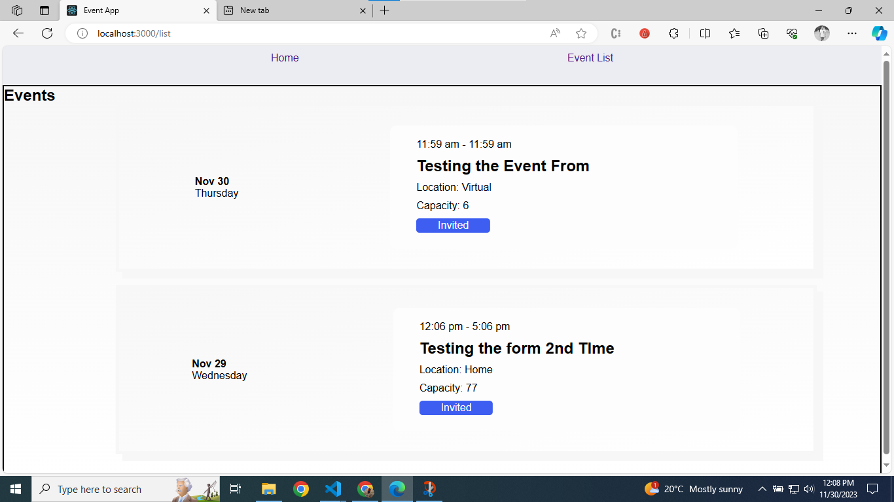

# Getting Started with Event Manage APP

### `npm start`

Runs the app in the development mode.\
Open [http://localhost:3000](http://localhost:3000) to view it in your browser.

# Event Create:

To create an event fill all the necessay details required in the form.
Press Enter or Click on Create Event.

# Event List Display
After submitting the form it will create an Event. That even can be accessed from the Navbar - Event List.

